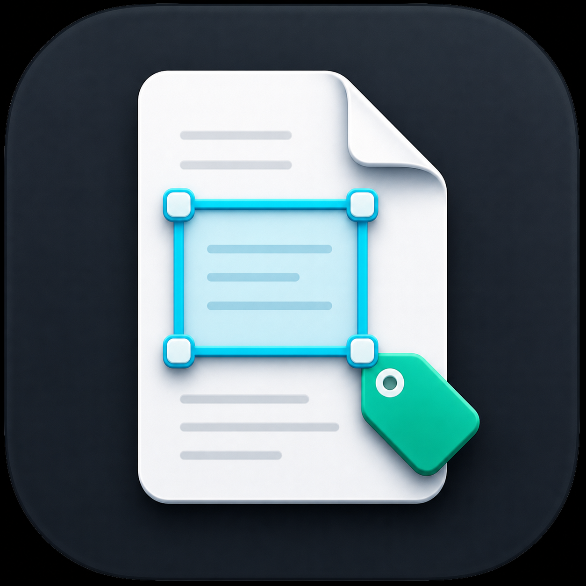

# Smart PDF Tagger

<p align="center">
  
</p>

<p align="center">
  <strong>Annotate PDFs, organize tagged regions, and export clean project data.</strong>
</p>

<p align="center">
  <a href="https://github.com/mistik91/smart-pdf-tagger/releases/latest"></a>
  
  
  
</p>

Smart PDF Tagger is a focused PDF annotation tool for marking document regions, attaching labels and comments, managing versions, and exporting the result as project JSON, CSV, or annotated PDF.

It runs as a browser app during development and ships as an Electron desktop app for native project open, save, and Save As workflows.

## Highlights

- PDF region annotation with draw, move, resize, edit, copy/paste, undo, and redo.
- Multipage navigation with page count, previous/next controls, direct page input, and page keyboard shortcuts.
- Labels, descriptions, tags, colors, visible comment indicators, and duplicate detection rules.
- Search, filtering, batch edits, annotation sorting, and reusable tag templates.
- Project metadata fields for client, document type, status, and reviewer.
- Version management for updated PDFs, including tag copying and version switching.
- Export controls for JSON, CSV fields, and annotated PDFs with labels, comments, and colors.
- Optional Gemini-assisted label suggestions and optional OneDrive project storage.
- Electron desktop build with native project file dialogs and a generated app icon.

## Download

The latest Windows installer is available from [GitHub Releases](https://github.com/mistik91/smart-pdf-tagger/releases/latest).

## Requirements

- Node.js `>=22.12.0`
- npm `>=10`
- Google Chrome for `npm run test:browser`

## Quick Start

For local development, install dependencies and start Vite:

```bash
npm install
npm run dev
```

Vite prints a local URL, usually:

```text
http://localhost:3000
```

## Configuration

Create a local environment file only when you need optional integrations:

```bash
cp .env.example .env.local
```

| Variable | Required | Purpose |
| --- | --- | --- |
| `GEMINI_API_KEY` | No | Enables AI-assisted label suggestions. |

The core PDF workflow runs without any environment variables.

## Desktop App

Run the desktop shell locally:

```bash
npm run electron:dev
```

Create a Windows installer:

```bash
npm run electron:dist
```

By default, Electron Builder writes release artifacts to `%TEMP%\smart-pdf-tagger-release`. Set `ELECTRON_BUILDER_OUTPUT` to override the output directory.

## Quality Gates

Run the full verification set before publishing changes:

```bash
npm run test
npm run typecheck
npm run build
npm run test:browser
npm run test:electron
npm audit --audit-level=moderate
```

## Documentation

- [Architecture](docs/ARCHITECTURE.md)
- [Testing](docs/TESTING.md)
- [Release process](docs/RELEASE.md)
- [Contributing](CONTRIBUTING.md)
- [Changelog](CHANGELOG.md)
- [Security](SECURITY.md)

## Project Layout

```text
assets/          App icon and static visual assets
components/      React UI components
e2e/             Browser workflow tests
e2e-electron/    Electron smoke tests
electron/        Main process and preload bridge
hooks/           React state and model hooks
services/        PDF export, cloud, and AI adapters
test/            Vitest setup
utils/           Pure helpers and business logic
```

## Data Notes

Project JSON files embed PDF data as base64, so large PDFs produce large project files. Browser storage is scoped to the current browser profile and is limited by browser quota. Desktop saves use the same project format through native file dialogs.
